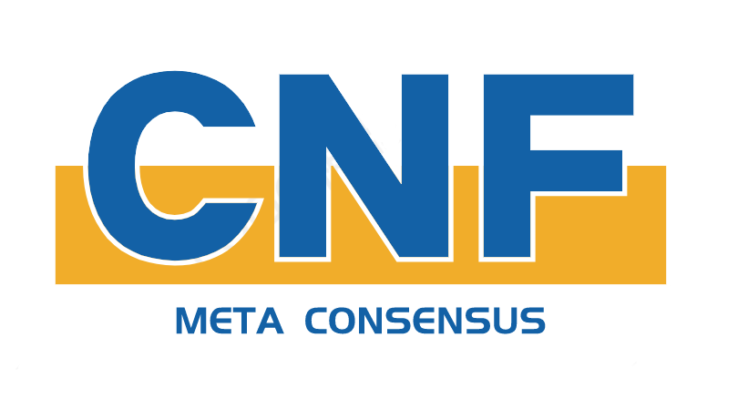

# CnF -- Meta Consensus （利益关系，项目暂闭源中）

Build a New Blockchain World By Meta Consensus.

<!-- PROJECT SHIELDS -->

[![Contributors][contributors-shield]][contributors-url]
[![Stargazers][stars-shield]][stars-url]
[![Issues][issues-shield]][issues-url]
[![GPL License][license-shield]][license-url]

<!-- PROJECT LOGO -->
<br />

<p align="center">
  <a href="https://github.com/SteveWooo/cnf_2">
    
  </a>

  <h3 align="center">"共识定制化"的区块链平台</h3>
  <p align="center">
    虚拟化共识多链的探索之旅
  </p>
</p>
 

### 上手指南

目前仅提供Mac和Centos上的运作Demo, 敬请期待！

###### 开发前的配置要求

Golang 1.16+

1. 下载仓库

```sh
git clone https://github.com/SteveWooo/cnf_2.git
```

2. **运行！**

```sh
cd cnf_2/runtime
bash run_demo.mac.sh
```

3. 打开基础操作面板

http://localhost:9024/static

### 使用示范

###### 1. 部署一个共识机制

在“基础区块浏览器”中，点击提交算法，按如下Demo填写
```javascript
// 发布类型：create
// 算法名称：test
// 算法脚本：

exports.CallTest = function(params) {
    MC_AddNewBlock(JSON.stringify(params))
}

// 创世区块：
{}

// 参与者节点：""
```

点击提交，等待共识

###### 2. 查询业务区块

在“业务算法区块浏览器”界面中，算法名称输入：test，然后查询区块。就会发现有一个区块啦~

###### 3. 提交交易

在“交易提交器界面中”
```javascript
// 算法名称：test
// 调用函数名：CallTest
// JSON参数：
{
  "Hello" : "World!",
  "This" : "is the Second Block."
}

```
点击提交，所有节点同步接收该请求，并同时执行。然后回到步骤2再查询一次，就会多了一个区块啦~

###### 其他Demo

<a href="https://github.com/SteveWooo/testin">方班教学实验平台</a>
里面我试着设计了一个共识算法，PoBR，结合业务逻辑的共识机制。

### 部署

程序主要通过命令行参数传入，由于目前还在实验阶段，暂时没对私钥做安全管理。

/runtime 文件夹下有相关的启动脚本，尤其是带Demo字样的，欢迎开发者们阅读并更改。

### 使用到的框架

- [levelDB fo Golang](github.com/syndtr/goleveldb)
- [V8 for Golang](github.com/robertkrimen/otto)
- [btcd](github.com/btcsuite/btcd)

### 贡献者

设计、开发者：**DeadFish🐡**

指导老师：**[田志宏](https://baike.baidu.com/item/田志宏/50882780)**

###### 如何参与开源项目

Email Us: **stevewoo23@gmail.com** 

### 作者

**DeadFish🐡**

### 版权说明

该项目签署了 GPL 授权许可，详情请参阅 [LICENSE.txt](https://github.com/SteveWooo/cnf_2/blob/master/LICENSE)

### 鸣谢

广州大学方滨兴实验班、胡宁教授、姜誉教授、薛岳同学、李爽同学、邓锦禧大佬

& 文昕~

<!-- links -->
[your-project-path]:shaojintian/Best_README_template
[contributors-shield]: https://img.shields.io/badge/%E5%BC%80%E5%8F%91%E8%80%85-DeadFish-green
[contributors-url]: https://github.com/shaojintian/Best_README_template/graphs/contributors
[stars-shield]: https://img.shields.io/badge/Star-0-yellow
[stars-url]: https://github.com/shaojintian/Best_README_template/stargazers
[issues-shield]: https://img.shields.io/badge/Issue-0-blue
[issues-url]: https://img.shields.io/github/issues/shaojintian/Best_README_template.svg
[license-shield]: https://img.shields.io/badge/License-GPL-green.svg?style=flat-square
[license-url]: https://github.com/shaojintian/Best_README_template/blob/master/LICENSE.txt


